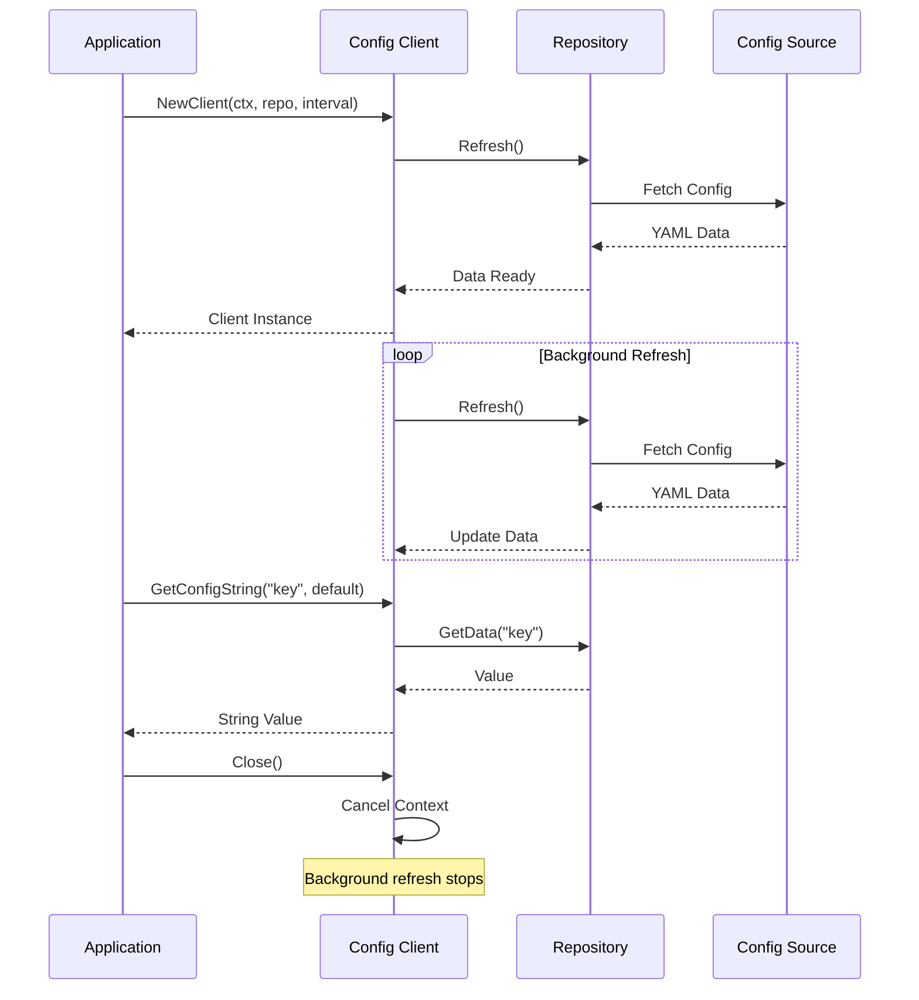

# 🚀 go-remote-config

[](https://github.com/sardine-ai/go-remote-config/actions/workflows/go.yml)
[](https://goreportcard.com/report/github.com/sardine-ai/go-remote-config)
[](https://codecov.io/gh/sardine-ai/go-remote-config)
[](https://go.dev/)

A lightweight, thread-safe remote configuration library for Go applications with automatic refresh, multiple backend support, and an optional HTTP server for serving configurations to clients.

---

## 📖 Overview

**go-remote-config** is a simple yet powerful remote configuration management library for Go. It allows you to load configuration from various sources (local files, cloud storage, Git repositories, web URLs) and automatically refreshes them at configurable intervals. The library is designed with thread-safety in mind, using proper synchronization primitives to prevent race conditions.

### Key Highlights

- 🔄 **Automatic Refresh**: Configuration is periodically refreshed in the background
- 🔒 **Thread-Safe**: All operations are protected with proper locking mechanisms
- ☁️ **Multi-Cloud Support**: Native support for AWS S3 and GCP Cloud Storage
- 📡 **HTTP Server Mode**: Serve configurations over HTTP with health endpoints
- 🎯 **Type-Safe Getters**: Retrieve configuration values with proper type casting
- 📊 **Health Monitoring**: Built-in staleness tracking and health checks for Kubernetes

---

## ✨ Features

| Feature | Description |
|---------|-------------|
| **Multiple Backends** | File, Web URL, Git Repository, AWS S3, GCP Cloud Storage |
| **Auto-Refresh** | Background goroutine automatically refreshes config at specified intervals |
| **Type-Safe Access** | Built-in methods for string, int, float, array, and custom struct retrieval |
| **Default Values** | Fallback to default values when config keys are not found |
| **HTTP Server** | Optional server mode with ETag support for efficient caching |
| **Health Endpoints** | `/health`, `/ready`, and `/status` endpoints for Kubernetes probes |
| **API Authentication** | Optional API key authentication with constant-time comparison |
| **Graceful Shutdown** | Proper signal handling and graceful HTTP server shutdown |
| **Race Condition Safe** | Extensively tested with Go's race detector |

---

## 🚀 Installation

```bash
go get github.com/sardine-ai/go-remote-config
```

---

## ✅ Requirements

- **Go 1.22+** (toolchain go1.23.1 recommended)
- For AWS S3: AWS credentials configured (via environment, shared credentials, or IAM role)
- For GCP Storage: GCP credentials configured (via `GOOGLE_APPLICATION_CREDENTIALS` or default credentials)

---

## 🛠️ Usage

### Client Mode

The client mode is used for applications that need to read configuration directly from a source.

#### File Repository

```go
package main

import (
    "context"
    "fmt"
    "time"

    "github.com/sardine-ai/go-remote-config/client"
    "github.com/sardine-ai/go-remote-config/source"
)

func main() {
    repository := &source.FileRepository{
        Path: "config.yaml",
        Name: "config",
    }

    ctx := context.Background()
    configClient, err := client.NewClient(ctx, repository, 10*time.Second)
    if err != nil {
        panic(err)
    }
    defer configClient.Close()

    // Get a string value
    name, err := configClient.GetConfigString("name", "default-name")
    if err != nil {
        fmt.Println("Using default:", name)
    } else {
        fmt.Println("Name:", name)
    }

    // Get an integer value
    age, err := configClient.GetConfigInt("age", 0)
    fmt.Println("Age:", age)

    // Get a custom struct
    type Address struct {
        Street  string `yaml:"street"`
        City    string `yaml:"city"`
        Country string `yaml:"country"`
    }
    var address Address
    err = configClient.GetConfig("address", &address, nil)
    fmt.Printf("Address: %+v\n", address)
}
```

#### Web Repository

```go
package main

import (
    "context"
    "fmt"
    "net/url"
    "time"

    "github.com/sardine-ai/go-remote-config/client"
    "github.com/sardine-ai/go-remote-config/source"
)

func main() {
    urlParsed, _ := url.Parse("https://example.com/config.yaml")

    repository := &source.WebRepository{
        URL:  urlParsed,
        Name: "config",
    }

    ctx := context.Background()
    configClient, err := client.NewClient(ctx, repository, 30*time.Second)
    if err != nil {
        panic(err)
    }
    defer configClient.Close()

    name, _ := configClient.GetConfigString("name", "")
    fmt.Println("Name:", name)
}
```

#### AWS S3 Repository

```go
package main

import (
    "context"
    "time"

    "github.com/sardine-ai/go-remote-config/client"
    "github.com/sardine-ai/go-remote-config/source"
)

func main() {
    repository := &source.AwsS3Repository{
        Name:       "config",
        BucketName: "my-config-bucket",
        ObjectName: "app/config.yaml",
        // Client is auto-initialized using default AWS credentials
    }

    ctx := context.Background()
    configClient, err := client.NewClient(ctx, repository, 60*time.Second)
    if err != nil {
        panic(err)
    }
    defer configClient.Close()

    // Use configuration...
}
```

#### GCP Cloud Storage Repository

```go
package main

import (
    "context"
    "time"

    "github.com/sardine-ai/go-remote-config/client"
    "github.com/sardine-ai/go-remote-config/source"
)

func main() {
    repository := &source.GcpStorageRepository{
        Name:       "config",
        BucketName: "my-config-bucket",
        ObjectName: "app/config.yaml",
        // Client is auto-initialized using default GCP credentials
    }

    ctx := context.Background()
    configClient, err := client.NewClient(ctx, repository, 60*time.Second)
    if err != nil {
        panic(err)
    }
    defer configClient.Close()

    // Use configuration...
}
```

#### Git Repository (Deprecated)

> ⚠️ **Deprecated**: This method is deprecated due to GitHub/GitLab API rate limits. Use CI/CD pipelines to push configs to S3/GCS instead.

```go
package main

import (
    "context"
    "net/url"
    "time"

    "github.com/sardine-ai/go-remote-config/client"
    "github.com/sardine-ai/go-remote-config/source"
    "github.com/go-git/go-git/v5/plumbing/transport/http"
)

func main() {
    urlParsed, _ := url.Parse("https://github.com/org/config-repo.git")

    repository := &source.GitRepository{
        URL:    urlParsed,
        Path:   "config.yaml",
        Branch: "main",
        Auth: &http.BasicAuth{
            Username: "user",
            Password: "token",
        },
    }

    ctx := context.Background()
    configClient, err := client.NewClient(ctx, repository, 300*time.Second)
    if err != nil {
        panic(err)
    }
    defer configClient.Close()
}
```

### Server Mode

The server mode provides an HTTP server that serves configuration to clients with built-in health endpoints.

```go
package main

import (
    "context"
    "time"

    "github.com/sardine-ai/go-remote-config/server"
    "github.com/sardine-ai/go-remote-config/source"
)

func main() {
    // Create repositories
    appConfig := &source.FileRepository{
        Path: "app-config.yaml",
        Name: "app",
    }

    featureFlags := &source.AwsS3Repository{
        Name:       "features",
        BucketName: "config-bucket",
        ObjectName: "feature-flags.yaml",
    }

    ctx := context.Background()
    srv := server.NewServer(ctx, []source.Repository{appConfig, featureFlags}, 30*time.Second)

    // Optional: Enable API key authentication
    srv.AuthKey = "your-secret-api-key"

    // Start with graceful shutdown handling
    if err := srv.StartWithGracefulShutdown(":8080"); err != nil {
        panic(err)
    }
}
```

#### HTTP Endpoints

| Endpoint | Description | Auth Required |
|----------|-------------|---------------|
| `GET /health` | Returns health status of all repositories | No |
| `GET /ready` | Returns readiness status (at least one repo working) | No |
| `GET /status` | Detailed status of all repositories | Yes |
| `GET /{repo-name}` | Raw configuration data for the repository | Yes |

### Global Functions

The library provides global functions that use a default client (set automatically by `NewClient`):

```go
// Uses the most recently created client
name, err := client.GetConfigString("name", "default")
age, err := client.GetConfigInt("age", 0)
score, err := client.GetConfigFloat("score", 0.0)
hobbies, err := client.GetConfigArrayOfStrings("hobbies", []string{})

var data MyStruct
err := client.GetConfig("data", &data, nil)

// Manually set a different default client
client.SetDefaultClient(myClient)
```

### Health Monitoring

```go
// Check if client is healthy (not stale)
if configClient.IsHealthy() {
    fmt.Println("Config is fresh")
}

// Get detailed refresh status
status := configClient.GetRefreshStatus()
fmt.Printf("Last refresh: %v\n", status.LastRefreshTime)
fmt.Printf("Refresh count: %d\n", status.RefreshCount)
fmt.Printf("Errors: %d\n", status.RefreshErrors)
fmt.Printf("Is stale: %v\n", status.IsStale)
```

---

## 🔧 Configuration

### Sample Configuration File (YAML)

```yaml
name: John
age: 30
email: john@example.com
is_employee: true
float_value: 3.14159

address:
  street: 123 Main St
  city: New York
  country: USA
  zip_code: "10001"

hobbies:
  - Reading
  - Cooking
  - Hiking
  - Swimming
  - Coding

database:
  host: localhost
  port: 5432
  name: myapp
```

### Environment Variables

| Variable | Description | Used By |
|----------|-------------|---------|
| `AWS_ACCESS_KEY_ID` | AWS access key | AWS S3 Repository |
| `AWS_SECRET_ACCESS_KEY` | AWS secret key | AWS S3 Repository |
| `AWS_REGION` | AWS region | AWS S3 Repository |
| `GOOGLE_APPLICATION_CREDENTIALS` | Path to GCP credentials JSON | GCP Storage Repository |
| `STORAGE_EMULATOR_HOST` | GCS emulator host (for testing) | GCP Storage Repository |

---

## 📦 Technologies

| Technology | Version | Purpose |
|------------|---------|---------|
| **Go** | 1.22+ | Core language |
| **cloud.google.com/go/storage** | v1.31.0 | GCP Cloud Storage client |
| **aws-sdk-go-v2** | v1.32.2 | AWS S3 client |
| **go-git/go-git** | v5.8.1 | Git repository operations |
| **gopkg.in/yaml.v3** | v3.0.1 | YAML parsing |
| **sirupsen/logrus** | v1.9.3 | Structured logging |
| **go-http-utils/etag** | - | HTTP ETag support |

---

## 🗂️ Repository Structure

```
go-remote-config/
├── 📄 go.mod                    # Go module definition
├── 📄 go.sum                    # Dependency checksums
├── 📄 README.md                 # This documentation
├── 📄 codecov.yml               # Codecov configuration
├── 📄 test.yaml                 # Sample test configuration
│
├── 📁 .github/
│   └── 📁 workflows/
│       └── 📄 go.yml            # GitHub Actions CI/CD workflow
│
├── 📁 client/                   # Client package - configuration consumer
│   ├── 📄 client.go             # Client implementation with auto-refresh
│   └── 📄 client_test.go        # Comprehensive client tests
│
├── 📁 server/                   # Server package - HTTP config server
│   ├── 📄 server.go             # HTTP server with health endpoints
│   └── 📄 server_test.go        # Server endpoint and auth tests
│
├── 📁 source/                   # Source package - repository backends
│   ├── 📄 repository.go         # Repository interface definition
│   ├── 📄 file_repository.go    # Local file backend
│   ├── 📄 web_repository.go     # HTTP URL backend
│   ├── 📄 git_repository.go     # Git repository backend (deprecated)
│   ├── 📄 aws_repository.go     # AWS S3 backend
│   └── 📄 gcp_repository.go     # GCP Cloud Storage backend
│
└── 📁 model/                    # Model package - data structures
    └── 📄 config.go             # Config struct definition
```

### Package Descriptions

| Package | Description |
|---------|-------------|
| **client** | Manages configuration data with automatic background refresh. Provides typed getters and health monitoring. |
| **server** | HTTP server that serves configuration data with ETag caching, authentication, and Kubernetes-compatible health endpoints. |
| **source** | Defines the `Repository` interface and provides implementations for various backends (file, web, Git, AWS S3, GCP Storage). |
| **model** | Contains shared data structures used across packages. |

---

## 🔗 Flow Chart

```mermaid
graph TB
    subgraph "Configuration Sources"
        A1[📁 Local File]
        A2[🌐 Web URL]
        A3[☁️ AWS S3]
        A4[☁️ GCP Storage]
        A5[📦 Git Repo]
    end

    subgraph "Source Layer"
        B1[FileRepository]
        B2[WebRepository]
        B3[AwsS3Repository]
        B4[GcpStorageRepository]
        B5[GitRepository]
    end

    subgraph "Repository Interface"
        C[Repository Interface<br/>GetData, GetRawData, Refresh]
    end

    subgraph "Client Mode"
        D1[Client]
        D2[Background Refresh<br/>Goroutine]
        D3[Health Monitoring]
    end

    subgraph "Server Mode"
        E1[HTTP Server]
        E2[/health Endpoint]
        E3[/ready Endpoint]
        E4[/status Endpoint]
        E5[/config Endpoints]
        E6[Auth Middleware]
    end

    subgraph "Application"
        F1[Your Go Application]
        F2[External HTTP Clients]
    end

    A1 --> B1
    A2 --> B2
    A3 --> B3
    A4 --> B4
    A5 --> B5

    B1 --> C
    B2 --> C
    B3 --> C
    B4 --> C
    B5 --> C

    C --> D1
    D1 --> D2
    D1 --> D3
    D1 --> F1

    C --> E1
    E1 --> E2
    E1 --> E3
    E1 --> E4
    E1 --> E5
    E5 --> E6
    E4 --> E6
    E1 --> F2

    style C fill:#e1f5fe
    style D1 fill:#c8e6c9
    style E1 fill:#fff3e0
```

### Data Flow



---

## 🤝 Contributing

Contributions are welcome! Please follow these guidelines:

1. **Fork** the repository
2. **Create** a feature branch (`git checkout -b feature/amazing-feature`)
3. **Commit** your changes (`git commit -m 'Add amazing feature'`)
4. **Push** to the branch (`git push origin feature/amazing-feature`)
5. **Open** a Pull Request

### Development Guidelines

- Run tests with race detector: `go test -race ./...`
- Ensure all tests pass before submitting
- Add tests for new functionality
- Follow existing code style and patterns
- Update documentation as needed

### Running Tests Locally

```bash
# Run all tests
go test -v ./...

# Run tests with race detection
go test -race -v ./...

# Run tests with coverage
go test -race -coverprofile=coverage.txt -coverpkg=./... ./...

# For S3 tests, start LocalStack first
docker run -d -p 4566:4566 localstack/localstack
```

---

## 📄 Documentation

### API Reference

#### Client Methods

| Method | Description |
|--------|-------------|
| `NewClient(ctx, repo, interval)` | Creates a new client with auto-refresh |
| `GetConfig(name, &data, default)` | Retrieves config into a struct pointer |
| `GetConfigString(name, default)` | Retrieves a string value |
| `GetConfigInt(name, default)` | Retrieves an integer value |
| `GetConfigFloat(name, default)` | Retrieves a float64 value |
| `GetConfigArrayOfStrings(name, default)` | Retrieves a string array |
| `GetRefreshStatus()` | Returns refresh health status |
| `IsHealthy()` | Returns true if config is not stale |
| `IsClosed()` | Returns true if client is closed |
| `Close()` | Stops background refresh |

#### Server Methods

| Method | Description |
|--------|-------------|
| `NewServer(ctx, repos, interval)` | Creates a new HTTP config server |
| `Start(addr)` | Starts the HTTP server |
| `StartWithGracefulShutdown(addr)` | Starts with signal handling |
| `Stop()` | Stops background refresh goroutines |
| `Shutdown()` | Gracefully shuts down the HTTP server |
| `IsHealthy()` | Returns true if all repos are healthy |
| `IsReady()` | Returns true if at least one repo works |

---

## ❤️ Acknowledgements

- [go-git](https://github.com/go-git/go-git) - Pure Go Git implementation
- [AWS SDK for Go v2](https://github.com/aws/aws-sdk-go-v2) - AWS S3 integration
- [Google Cloud Go](https://github.com/googleapis/google-cloud-go) - GCP Storage integration

---

## 📝 Changelog

### Recent Changes

| Commit | Description |
|--------|-------------|
| `51bb06b` | Merge: v2-repositories - Enhanced repository implementations |
| `2b3dc9b` | Merge: v2-client - Client improvements and thread-safety |
| `ee64268` | Merge: v2-server - Server enhancements with health endpoints |
| `b8b380c` | Fix: Unmarshal outside lock to prevent data corruption |
| `d50a058` | Fix: IsHealthy() only checks staleness, not last refresh error |
| `4a56257` | Fix: Require auth for /status endpoint (only /health and /ready bypass) |
| `fe1deef` | Fix: Address PR review comments |
| `2fd98de` | Feat: Add health endpoints, graceful shutdown, and fix race conditions |
| `8f6660d` | Fix: Client race conditions and add staleness tracking |
| `288db2a` | Fix: Improve thread-safety in repository implementations |
| `cfcec3c` | Merge: AWS S3 support |
| `1ab7be5` | Add S3 remote config repository |
| `cdf6cc8` | Update GCP repository |
| `c159284` | Rename module to sardine-ai |

### Version Tags

| Tag | Description |
|-----|-------------|
| `v1.0.4` | Latest stable release |
| `v1.0.3` | Previous stable release |
| `v1.0.2` | Minor updates |
| `v1.0.1` | Initial release |

---

## 📜 License

This project is maintained by [Sardine AI](https://github.com/sardine-ai).

---

<p align="center">
  Made with ❤️ by the Sardine AI team
</p>
